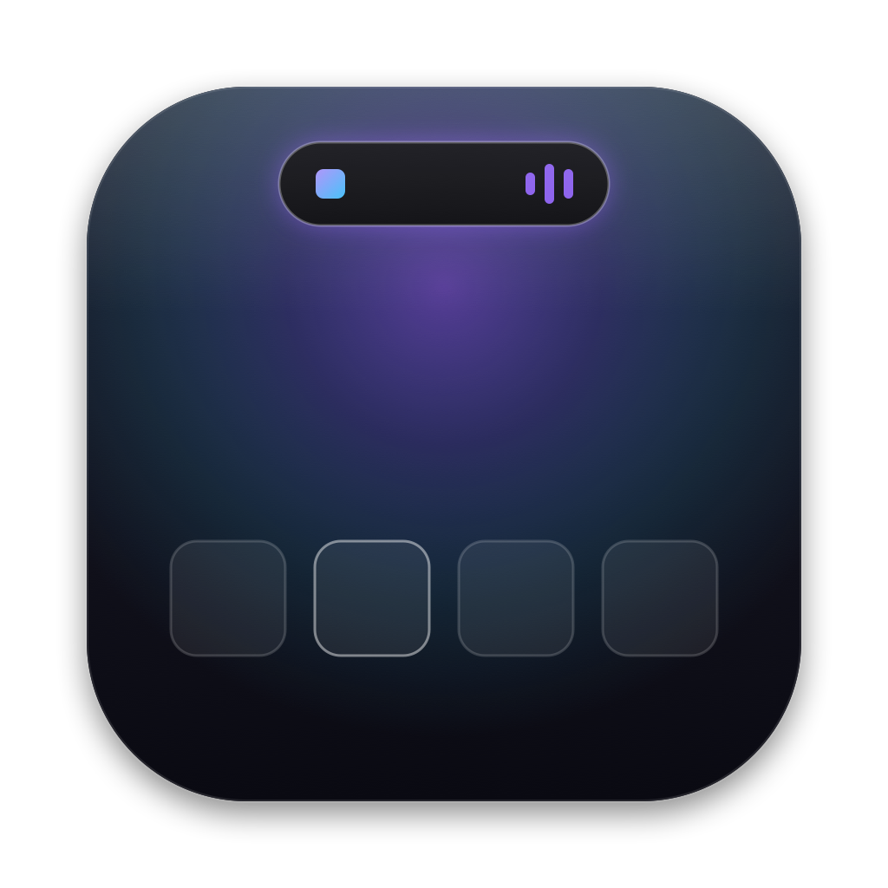
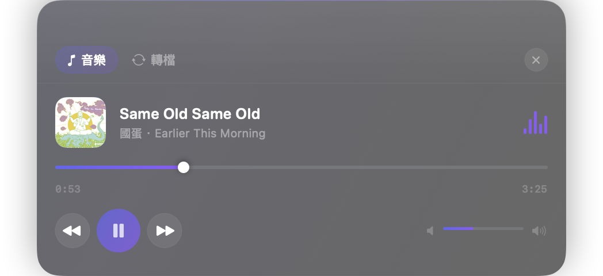
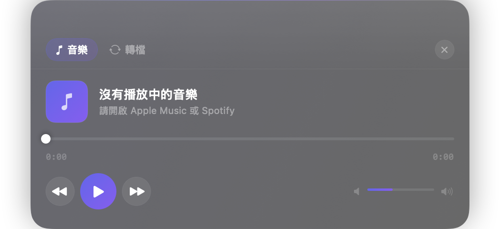

# NotchGlass

**把 MacBook 瀏海變成 Liquid Glass 風格的生產力中樞**
音樂控制 × 拖放檔案操作 × 格式轉換，全部住進瀏海裡。

*A Liquid Glass–style notch hub for macOS — music control, drag-and-drop file actions, and format conversion.*

**[前 200 名永久免費 / Free for the first 200](https://harryverse277.gumroad.com/l/oxkzgr/EARLY200?wanted=true)** · 之後 US$6+ 買斷 / then US$6+ once

---

## ✨ 功能特色

### 🎵 音樂控制

- 同時支援 **Spotify 與 Apple Music**，自動偵測切換
- 曲名／演出者／專輯／**專輯封面**，封面三路備援（Spotify CDN → iTunes Search API → 快取），換歌交叉淡入
- Spotify 風格加粗時間軸，支援點擊與拖曳精準 seek
- 閒置時瀏海兩側露出迷你封面與動態音波（Dynamic Island 風格）

### ☕ 保持喚醒與跨桌面
- 一鍵阻止閒置造成的螢幕關閉與自動休眠，退出 App 自動恢復
- 跟隨所有 macOS Spaces，不出現在 Dock、Command-Tab 或一般視窗循環

### 📂 拖放四格操作

拖著檔案**靠近瀏海**面板才展開（離開即收回，不干擾視野）：

| 格子 | 功能 |
|---|---|
| **NotchClip** | 複製到暫存夾並放上剪貼簿，到處 ⌘V |
| **Convert** | 就地格式轉換 |
| **AirDrop** | 直接開啟 AirDrop 傳送 |
| **iCloud** | 上傳到 iCloud Drive |

### 🔄 格式轉換引擎
- 圖片互轉：HEIC / PNG / JPG / TIFF / WebP（執行期偵測編碼能力）
- 圖片 ↔ PDF：多張圖合併單一 PDF、PDF 逐頁輸出 2x PNG
- 影片：MOV → MP4、**原生 GIF 轉換**（不依賴 ffmpeg）
- **Word ⇄ PDF**：DOCX → PDF（自動分頁）、PDF → DOCX（保留文字樣式）
- TXT → HTML：自動辨識「HTML 原始碼存成 .txt」並還原（`名字.html.txt → 名字.html`）
- 多檔批次、輸出與原檔同目錄、重名自動編號絕不覆蓋

## 🏗 技術深掘

工程設計細節與核心程式碼導讀請見 **[ARCHITECTURE.md](ARCHITECTURE.md)**，
完整產品規格書請見 **[SPEC.md](SPEC.md)**。

重點包括：

- **零干擾視窗架構**：`NSPanel` 隨狀態動態調整大小——閒置時縮到藥丸尺寸，桌面完全不被隱形視窗覆蓋；拖曳時才放大為捕捉區
- **拖曳偵測三重保障**：全域事件監聽 ＋ 拖曳剪貼簿 changeCount 輪詢 ＋ AppKit `draggingEntered`
- **免權限音樂 metadata**：`DistributedNotification` ＋ `MediaRemote`，AppleScript 僅作增強路徑（含 TCC 懸置看門狗）
- **Liquid Glass 視覺**：常駐 `NSVisualEffectView`、連續圓角、鏡面高光、spring 形變動畫
- **Gumroad 授權系統**：3 天試用 ＋ 金鑰驗證 ＋ 離線容錯，狀態存 Keychain

> 📦 本 repo 為作品集展示（架構文件＋核心程式碼導讀）。完整原始碼為私有，面試或技術交流歡迎來信展示：harryjia1007@gmail.com

## 🚀 下載安裝

1. [Gumroad 早鳥頁](https://harryverse277.gumroad.com/l/oxkzgr/EARLY200?wanted=true) 下載 `NotchGlass.dmg`
2. 打開 DMG，把 NotchGlass 拖進 Applications
3. 直接開啟已完成 Apple 公證的 NotchGlass
4. 前 200 名免費結帳後輸入 Gumroad 金鑰，即可永久解鎖

> 系統需求：macOS 13+，有無實體瀏海皆可使用

## 📄 授權

© 2026 Chia-Peng Chen (Harry). All rights reserved.

---

Built with SwiftUI + AppKit · Designed with Liquid Glass

