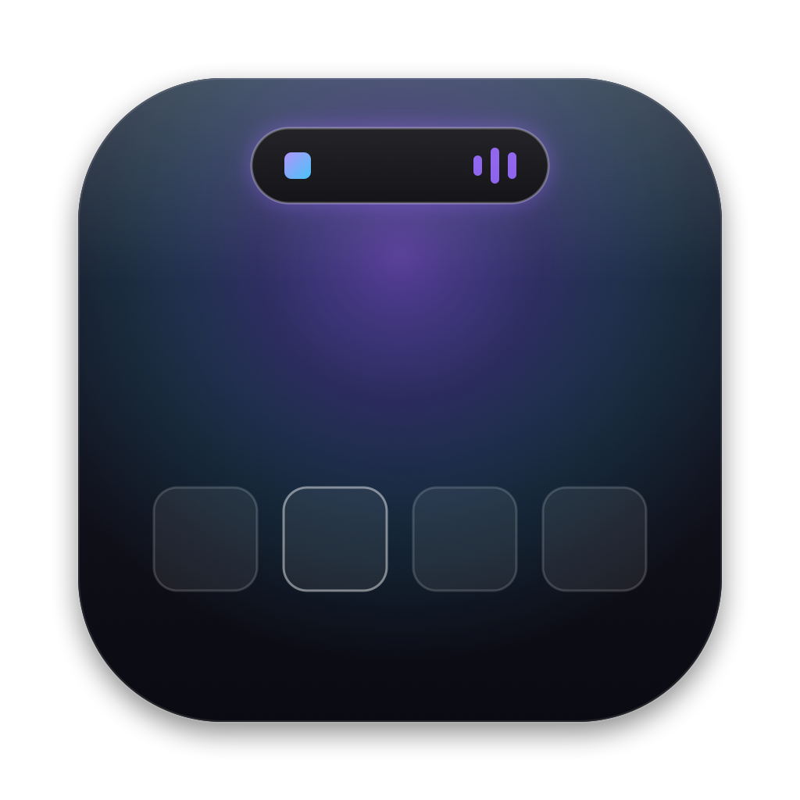

# NotchGlass

**Convert files locally. Right from your Mac's notch.**

**把常用檔案轉換，放到 Mac 的瀏海。**

[Get NotchGlass · From US$6](https://gum.co/u/dhcmlwql)

USD · One-time purchase · Lifetime license for up to 2 Macs · No subscription

14-day refund window on paid purchases · macOS 13 or later

## A shorter path from a file to the format you need

Drag a supported file toward the notch, drop it on **Convert**, select an output
format, and open the result. Conversion runs on your Mac, without sending the
file to an online conversion service.

NotchGlass is for people who repeat these small file handoffs throughout the day.
If Preview and Finder already fit your workflow, you may not need another app.

| Workflow | What to expect |
| --- | --- |
| Images | Convert supported formats such as PNG, JPEG and HEIC. Available outputs depend on macOS encoding support. |
| Images and PDF | Combine images into a PDF, or export PDF pages as images. |
| Documents and media | Convert supported documents, audio and video. Some media formats require separately installed FFmpeg. |
| NotchClip | Copy files to the local NotchClip folder and place file references on the clipboard. This is not a clipboard-history service. |
| AirDrop and iCloud | Open the system AirDrop flow or save to iCloud Drive. macOS controls receiving devices and cloud synchronization. |

**PDF-to-DOCX is not a layout-preservation guarantee.** Fonts, tables, complex
layouts and scanned PDFs need review; scanned-document OCR is not included.
Check the output before sharing it. Ask about your specific format before buying.

## Music, close at hand

Desktop Spotify and Apple Music integrations provide playback information and
controls when supported by the source and permissions. Artwork, seeking and
source switching can vary; macOS Automation permission may be needed.

YouTube / YouTube Music browser fallback has more limited, browser-dependent
capabilities. It is not equivalent to a fully supported desktop integration.

Keep Awake can prevent idle display sleep while enabled. It does not override
manual sleep or closing your MacBook lid, and releases when the app quits.

## Buy, install and update

**Current public download: 1.5.15** (checked 2026-09-29). See [version.json](version.json).
This is a Developer ID distribution, not a Mac App Store release.

1. [Buy from US$6 on Gumroad](https://gum.co/u/dhcmlwql). A higher support amount is optional; check USD pricing and any taxes at checkout.
2. Download the current DMG from your purchase content and drag NotchGlass into Applications.
3. Open the app. The release is Developer ID signed and Apple-notarized; macOS may still show a first-download confirmation or a permission request.
4. Find your License Key in the purchase content and enter it in Settings. Never post your key publicly.
5. Updates are manual: download the new release from the same purchase, quit NotchGlass and replace the app. Keep preferences and Keychain data.

The release targets macOS 13+, Apple Silicon and Intel, including Macs without a
physical notch. This is not a claim that every OS, display or Spaces configuration
has been tested. Contact support about your setup if uncertain.

File conversion is local. License checks, update checks and artwork lookups may
use the network. Choosing AirDrop or iCloud intentionally uses those services.

For support or a refund within 14 days of a paid purchase, email
[harryjia1007@gmail.com](mailto:harryjia1007@gmail.com) from your order email.
Any longer refund window previously promised for an existing order is honored.

## 繁體中文

拖著支援的檔案靠近瀏海，放到 **Convert**，選擇格式，再開啟轉換結果。
轉檔在本機執行，不需要把檔案交給線上轉檔網站。

- 常見用途：PNG／JPEG／HEIC 等圖片轉換、多圖合併 PDF、PDF 頁面輸出成圖片。
- 文件與影音依來源格式及系統能力提供選項；部分影音格式需要額外 FFmpeg。
- PDF 轉 Word 不保證完整保留表格、字型與排版，也不含掃描 OCR；請核對輸出結果。
- 音樂控制與封面依播放器、權限和來源而異；瀏覽器 fallback 不代表完整支援。
- NotchClip 是本機檔案暫存；AirDrop 由系統處理；存入 iCloud 不等於已同步完成。

**[US$6 起取得 NotchGlass](https://gum.co/u/dhcmlwql)**：美元計價、一次付費、
最多 2 台 Mac 的永久授權、無訂閱；付費後 14 天可申請退款。
目前正式下載為 **1.5.15**，不以尚未發布的候選版本作功能承諾。

購買內容內有 DMG 與 License Key。把 App 移入 Applications，再到設定貼上金鑰。
更新時由原購買紀錄下載新版，退出 App 後替換；不要刪除偏好設定或鑰匙圈資料。
安裝、格式相容性或授權問題請使用訂單信箱聯繫上方客服，不要公開金鑰。

## About this repository

This is a **public product showcase**, not an open-source distribution of the app.
The complete source code is private. The links below contain historical engineering
notes, not current release guarantees:

- [Architecture notes](ARCHITECTURE.md)
- [Historical design specification](SPEC.md)
- [Media provenance and limitations](docs/MEDIA.md)

The purchase supports a maintained, packaged macOS app; it is not a source-code license.
No account credential, signing key or buyer information belongs in this repository.

© 2026 Chia-Peng Chen (Harry). All rights reserved.
