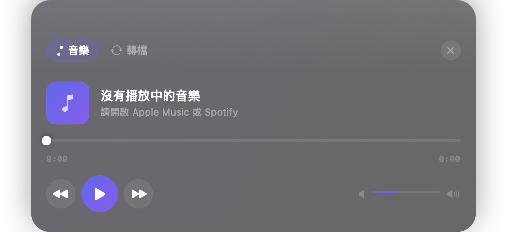
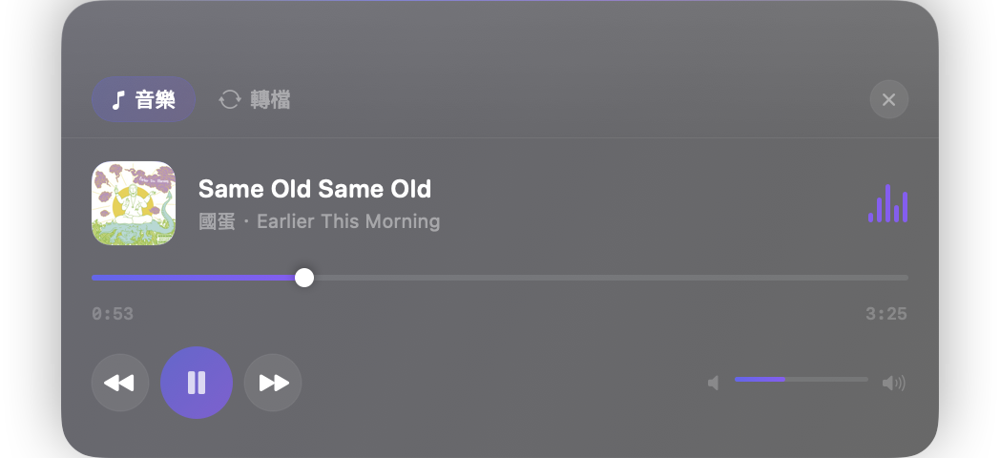

# NotchGlass

**Your MacBook notch, finally useful.**
Drop files on it to convert, AirDrop, or stash them — and control your music from it.

**[Get it for US$6](https://harryverse277.gumroad.com/l/oxkzgr?wanted=true)** · one-time purchase · 14-day money-back guarantee

macOS 13+ · Developer ID signed & notarized · Works with or without a physical notch

---

## What it does

Every app treats the notch as an obstacle to design around. NotchGlass makes it a
place you drop things.

Drag a file **toward the notch** and the panel expands. Let go on one of four tiles:

| Tile | What it does |
|---|---|
| **Convert** | Converts the file in place — locally |
| **AirDrop** | Opens AirDrop with the file ready to send |
| **iCloud** | Saves it to iCloud Drive |
| **NotchClip** | Stashes it on a shelf and puts it on your clipboard |

The panel only opens while you're dragging near it. The rest of the time it collapses
to a small pill that shows album art and a waveform.

### Conversion runs entirely on your Mac

No upload, no queue, no "your file will be deleted in one hour" you have to trust.
Built on Apple's own frameworks (ImageIO, AVFoundation, PDFKit, Core Graphics).

- **Images** — HEIC / PNG / JPG / TIFF / WebP (encoder support detected at runtime)
- **Images ⇄ PDF** — merge many images into one PDF; export PDF pages as 2× PNG
- **Video** — MOV → MP4, and native GIF export (no ffmpeg dependency)
- **Word ⇄ PDF** — DOCX → PDF with pagination; PDF → DOCX preserving text styling
- **TXT → HTML** — detects HTML source saved as `.txt` and restores it
- Batch conversion, output beside the original, never overwrites (auto-numbered)

**PDF → Word tables actually survive.** Most converters — including the big online
ones — flatten tables into loose absolutely-positioned text, and you rebuild the
layout by hand. NotchGlass reads the rectangle-drawing operators out of the PDF's
content stream to recover the real grid, then emits a proper Word table.

### Music

- **Spotify and Apple Music**, detected and switched automatically
- Title / artist / album / **artwork**, with a three-tier artwork fallback
  (Spotify CDN → iTunes Search API → cache) and a cross-fade on track change
- A bold, scrubbable timeline — click or drag to seek
- When idle, a mini cover and a live waveform peek out beside the notch

### Also

- **Keep awake** — one click blocks idle sleep; restores your settings on quit
- **Follows every Space**, full-screen app, and Stage Manager
- Never appears in the Dock, Command-Tab, or the normal window cycle

## Engineering notes

Architecture write-up: **[ARCHITECTURE.md](ARCHITECTURE.md)** · Full spec: **[SPEC.md](SPEC.md)**

- **Non-intrusive window architecture** — the `NSPanel` resizes with state: it collapses
  to pill size when idle so no invisible window covers your desktop, and only expands
  into a capture area once a drag begins
- **Triple-redundant drag detection** — global event monitor + drag pasteboard
  `changeCount` polling + AppKit `draggingEntered`. None is reliable alone; the
  `changeCount` comparison is what stops marquee selection from false-triggering
- **Permission-free music metadata** — `DistributedNotification` + `MediaRemote`,
  with AppleScript only as an enhancement path (behind a TCC hang watchdog)
- **Liquid Glass visuals** — persistent `NSVisualEffectView`, continuous corner radii,
  specular highlights, spring deformation animation
- **Licensing** — 3-day trial + Gumroad key validation + offline tolerance, stored in Keychain

> 📦 This repo is a portfolio showcase (architecture docs + code walkthrough).
> The full source is private. Happy to walk through it for interviews or technical
> discussion — harryjia1007@gmail.com

## Install

1. Download `NotchGlass.dmg` from the [Gumroad page](https://harryverse277.gumroad.com/l/oxkzgr?wanted=true)
2. Open the DMG and drag NotchGlass into Applications
3. Launch it — the build is Developer ID signed and Apple-notarized
4. Enter the Gumroad license key from your receipt to unlock permanently

> Requires macOS 13 or later. Works on Macs with or without a physical notch.

---

<b>繁體中文說明</b>

 

**把 MacBook 瀏海變成 Liquid Glass 風格的生產力中樞**——音樂控制 × 拖放檔案操作 × 格式轉換。

拖著檔案**靠近瀏海**，面板才展開（離開即收回，不干擾視野），放到四格之一：

| 格子 | 功能 |
|---|---|
| **Convert** | 就地格式轉換 |
| **AirDrop** | 直接開啟 AirDrop 傳送 |
| **iCloud** | 上傳到 iCloud Drive |
| **NotchClip** | 存入暫存夾並放上剪貼簿，到處 ⌘V |

**轉換全部在你的 Mac 上完成，不上傳任何檔案。**

- 圖片互轉：HEIC / PNG / JPG / TIFF / WebP
- 圖片 ↔ PDF：多張圖合併單一 PDF、PDF 逐頁輸出 2x PNG
- 影片：MOV → MP4、原生 GIF 轉換（不依賴 ffmpeg）
- Word ⇄ PDF：DOCX → PDF 自動分頁、PDF → DOCX 保留文字樣式
- **PDF → Word 的表格不會跑版**：直接讀 PDF 內容串流的矩形繪製指令還原真正的格線，
  輸出成 Word 原生表格，不是一堆散落的文字
- TXT → HTML：自動辨識「HTML 原始碼存成 .txt」並還原
- 多檔批次、輸出與原檔同目錄、重名自動編號絕不覆蓋

音樂：Spotify 與 Apple Music 自動偵測切換、專輯封面三路備援、可拖曳 seek 的時間軸；
閒置時瀏海兩側露出迷你封面與動態音波。

其他：一鍵保持喚醒（退出自動恢復）、跟隨所有 Spaces 與全螢幕 App、
不出現在 Dock 與 Command-Tab。

系統需求 macOS 13+，有無實體瀏海皆可使用。已完成 Developer ID 簽章與 Apple 公證。

**[US$6 一次買斷](https://harryverse277.gumroad.com/l/oxkzgr?wanted=true)**，不綁訂閱，14 天不滿意全額退費。

## License

© 2026 Chia-Peng Chen (Harry). All rights reserved.

---

Built with SwiftUI + AppKit · Designed with Liquid Glass

